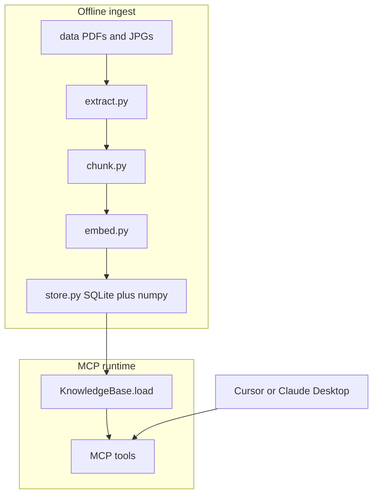

# Caseware Procurement Knowledge Base

Local RAG pipeline and MCP server for the Caseware Senior AI Data take-home exercise.

## Quick start (how to run)

Run these steps **in order** from the project root:

```bash
cd /Users/rafael/Projects/CASEWARE

# 1. Create and activate the virtual environment (once)
python3 -m venv .venv
source .venv/bin/activate

# 2. Install dependencies (once)
pip install -e .

# 3. Configure API key (once) � optional if using local embeddings
cp .env.example .env
# Edit .env and set OPENAI_API_KEY=sk-...

# 4. Build the knowledge base index (run after setup, or when data changes)
python scripts/ingest.py

# 5. Use the MCP server from Cursor (recommended)
#    See "Connect from Cursor" below � reload MCP after config changes.
#    Then ask questions in Cursor chat, e.g.:
#    "Which documents support order 10687?"

# Optional: run MCP server manually in a terminal (stdio � for debugging only)
# python mcp_server/server.py
```

**Expected ingest output:** JSON summary with `documents_indexed`, `chunks_indexed`, and `artifact_dir: ".../artifacts"`. If that folder exists with `kb.sqlite` and `vectors.npy`, the index is ready.

**Typical workflow:**

| Step | Command | When |
|------|---------|------|
| Setup | `pip install -e .` + `.env` | Once |
| Index data | `python scripts/ingest.py` | Once, or after adding/changing files in `data/` |
| Query via agent | Cursor MCP **caseware-kb** | Every session |

The MCP server does **not** expose a web UI. It communicates over stdio with Cursor (or another MCP client). Running `python mcp_server/server.py` in a terminal will appear to hang � that is normal; connect it through Cursor instead.

## Prerequisites

- Python 3.11+
- OpenAI API key (optional; local embeddings are used automatically if OpenAI quota is unavailable)
- [Tesseract OCR](https://github.com/tesseract-ocr/tesseract) for invoice JPGs
  - macOS: `brew install tesseract`

## Setup (detailed)

Same steps as Quick start; use this if you need more context.

```bash
cd /Users/rafael/Projects/CASEWARE

python3 -m venv .venv
source .venv/bin/activate

pip install -e .

cp .env.example .env
# Edit .env and set OPENAI_API_KEY=sk-...
```

On macOS, activate the venv in each new terminal:

```bash
source /Users/rafael/Projects/CASEWARE/.venv/bin/activate
```

### Environment variables

| Variable | Default | Description |
|----------|---------|-------------|
| `OPENAI_API_KEY` | - | OpenAI key for embeddings |
| `CASEWARE_EMBEDDING_PROVIDER` | `openai` | `openai` or `local` |
| `CASEWARE_LOCAL_EMBEDDING_MODEL` | `all-MiniLM-L6-v2` | Local fallback model |
| `CASEWARE_DATA_DIR` | `data` | Source documents |
| `CASEWARE_ARTIFACTS_DIR` | `artifacts` | Generated index |

If OpenAI returns a quota error during ingest, the pipeline automatically falls back to local embeddings and records the provider in `artifacts/manifest.json`.

## Run the data pipeline

**Must run before using MCP.** Re-run if you add documents or install Tesseract for JPG OCR.

```bash
source .venv/bin/activate
python scripts/ingest.py
```

Alternative entry point:

```bash
caseware-ingest
```

This will:

1. Scan `data/` for PDFs and images
2. Extract text (PyMuPDF for PDFs, Tesseract for JPGs)
3. Chunk text and infer metadata (`doc_type`, `order_id`, inventory `period`)
4. Build embeddings and persist:
   - `artifacts/kb.sqlite`
   - `artifacts/vectors.npy`
   - `artifacts/manifest.json`

## Run the MCP server

The MCP server reads the pre-built index from `artifacts/` � it does **not** ingest documents at startup.

### Option A � Cursor (recommended)

1. Ensure ingest has completed (`artifacts/kb.sqlite` exists).
2. Config is in [`.cursor/mcp.json`](.cursor/mcp.json) (and optionally `~/.cursor/mcp.json`).
3. Restart Cursor or reload MCP in **Settings ? MCP**.
4. Enable **caseware-kb** and ask questions in chat.

### Option B � Manual stdio (debugging)

```bash
source .venv/bin/activate
python mcp_server/server.py
```

This blocks the terminal waiting for an MCP client on stdin/stdout. Use only to debug; normal usage is through Cursor.

Alternative entry point:

```bash
caseware-mcp
```

### Connect from Cursor

Project config: [`.cursor/mcp.json`](.cursor/mcp.json)

Also added to your global Cursor MCP settings (`~/.cursor/mcp.json`).

Restart Cursor (or reload MCP servers in Settings > MCP), then enable **caseware-kb**.

```json
{
  "mcpServers": {
    "caseware-kb": {
      "command": "/Users/rafael/Projects/CASEWARE/.venv/bin/python",
      "args": ["/Users/rafael/Projects/CASEWARE/mcp_server/server.py"],
      "cwd": "/Users/rafael/Projects/CASEWARE",
      "env": {
        "CASEWARE_EMBEDDING_PROVIDER": "local"
      }
    }
  }
}
```

## Architecture overview



## Data flow

1. Files in `data/` are classified by folder (`invoices`, `purchase_orders`, etc.).
2. `order_id` is parsed from filenames (`invoice_10687.pdf`) or document text (`Order ID: 10687`).
3. Text is chunked (~900 chars, 100 overlap) with page references preserved.
4. Embeddings are stored in `vectors.npy`; metadata and chunk text live in SQLite.
5. MCP tools query the pre-built index (no extraction at request time).

## Data modeling

| Field | Source | Used for |
|-------|--------|----------|
| `doc_type` | folder name | filtering, gap analysis |
| `order_id` | filename / OCR / text | cross-document joins |
| `period` | inventory filename | inventory report queries |
| `page` | PDF page / OCR page | citations |
| `chunk_id` | generated | source references |

## Retrieval strategy

The system uses **layered retrieval** — not a single search engine. Implementation: [`src/caseware_kb/retrieve.py`](src/caseware_kb/retrieve.py).

| Layer | When | How |
|-------|------|-----|
| Structured routing | Order IDs, gaps, inventory lists | SQL on metadata (`matching.py`) |
| Vector search | Semantic questions (contract terms, concepts) | Cosine similarity on chunk embeddings |
| Keyword fallback | Vector search returns no hits | SQL `LIKE '%term%'` with AND across query terms |

**What we do not use:** BM25, SQLite FTS5, or score fusion (RRF). The current keyword fallback is a simple substring match, not ranked lexical retrieval.

**Hybrid flow today:** try vector search first; if empty, fall back to keyword `LIKE`. See `hybrid_search()` in `retrieve.py`.

### Structured extraction vs document retrieval

- **Structured:** `order_id`, `doc_type`, and `period` are parsed at ingest time and queried via dedicated MCP tools. Best for audit-style questions with clear keys (order 10687, missing POs).
- **Document retrieval:** chunk text + embeddings for open-ended questions (contract clauses, vendor/item mentions). Returns cited snippets, not pre-extracted fields.

### Future improvement: BM25 lexical search

**Why it would help:** Vector search finds semantically similar text but can miss exact tokens (order numbers, product SKUs, legal clause references like "Clause 7", vendor names). Our current `LIKE` fallback has no relevance ranking and requires all terms to match.

**How BM25 works:** BM25 (Best Matching 25) is a probabilistic ranking function for keyword search. For each query term it scores documents higher when:

- the term appears often in the chunk (term frequency), with diminishing returns;
- the term is rare across the whole corpus (inverse document frequency — discriminative terms rank higher);
- shorter chunks are not unfairly boosted (length normalization).

A typical upgrade path for this project:

1. Index chunk text in **SQLite FTS5** (or a small BM25 library) at ingest time.
2. Run **vector search and BM25 in parallel** on the same query.
3. **Merge ranks** (e.g. reciprocal rank fusion) so exact ID/clause matches and semantic matches both surface.

That would improve queries like *"Find evidence for product Spegesild"* or *"Clause 14 damages"* without replacing the structured tools for order-level joins.

## MCP tools

| Tool | Purpose |
|------|---------|
| `search_knowledge_base` | Semantic search with optional `doc_type` / `order_id` filters |
| `get_order_documents` | All documents for an order ID |
| `find_document_gaps` | Invoices without PO, shipping without invoice, etc. |
| `list_inventory_reports` | Available stock reports and periods |
| `get_source_excerpt` | Expand a cited chunk |

## Citation strategy

Search results return:

- `chunk_id`, `doc_id`, `doc_type`
- `file_path`, `page`, `order_id`
- `score`, `snippet`

Use `get_source_excerpt(chunk_id=...)` for longer grounded context.

## MCP demo evidence

Validated with **caseware-kb** MCP server connected in Cursor (June 2026).

### 1. Order document bundle � `get_order_documents`

**Query:** "Which documents support order 10687?"

**Tool:** `get_order_documents(order_id="10687")`

| Type | Document | Path | Pages |
|------|----------|------|-------|
| Invoice | invoice 10687 | `data/invoices/invoice_10687.pdf` | 1 |
| Shipping order | order 10687 | `data/shipping_orders/order_10687.pdf` | 2 |

No purchase order, inventory report, or contract is linked to this order. Customer: **HUNGO** (Hungry Owl All-Night Grocers), order date **2017-09-30**.

---

### 2. Cross-document gaps � `find_document_gaps`

**Query:** "Which invoices are missing a matching purchase order?"

**Tool:** `find_document_gaps()`

**Invoices without PO (3):**

| Order ID | Invoice on file |
|----------|-----------------|
| 10436 | Yes � no matching PO |
| 10687 | Yes � no matching PO |
| 10839 | Yes � no matching PO |

**Context from the knowledge base:**

- 8 invoices, 8 purchase orders, 16 shipping orders indexed
- **5 order IDs** with full invoice + PO + shipping match: `10248`, `10382`, `10442`, `10603`, `10711`

---

### 3. Contract terms � `search_knowledge_base`

**Query:** "Summarize contract terms relevant to supply of goods"

**Tool:** `search_knowledge_base(query="contract terms supply of goods", doc_type="contract")`

**Source:** TotalEnergies Master Contract for Supply of Goods and/or Services (dated 20231231)

Key terms retrieved from indexed contract chunks (primarily **Clause 7**, with supporting clauses):

| Topic | Summary |
|-------|---------|
| Framework | Master Contract + Order Requests; no exclusivity; open Orders survive contract end |
| Ordering | Each Order specifies goods, quantity, delivery date/site, and price |
| Delivery (Clause 7) | Deliver on date at place; partial deliveries need consent; Supplier bears transport/packing risk |
| Title & risk | Title on identification/payment/acceptance; default Incoterms **DDP** if unspecified |
| Quality | Goods must conform to specs, Good Industry Practice, and Applicable Laws |
| Warranty | 12 months from first use or 18 months from delivery (whichever ends first) |
| Acceptance (Clause 9) | Customer inspects; may accept, accept with reserves, or refuse non-conforming goods |
| Pricing (Clause 13) | Firm prices; payment within 30 days; invoices must reference order and goods |
| Remedies (Clause 14) | Late/non-conforming delivery triggers damages and third-party procurement rights |

**Practical takeaway:** Customer-favorable terms on delivery, conformity, warranty, and remedies � with firm pricing and clear rights to reject, terminate, or substitute supply.

---

### 4. Inventory reports � `list_inventory_reports`

**Query:** "What inventory reports are available?"

**Tool:** `list_inventory_reports()`

**7 stock reports** (1 page each), covering **July 2016 through January 2018**:

| Period | Report | File |
|--------|--------|------|
| 2016-07 | StockReport 2016-07 8 | `data/inventory_reports/StockReport_2016-07_8.pdf` |
| 2016-12 | StockReport 2016-12 1 | `data/inventory_reports/StockReport_2016-12_1.pdf` |
| 2017-03 | StockReport 2017-03 6 | `data/inventory_reports/StockReport_2017-03_6.pdf` |
| 2017-06 | StockReport 2017-06 7 | `data/inventory_reports/StockReport_2017-06_7.pdf` |
| 2017-09 | StockReport 2017-09 4 | `data/inventory_reports/StockReport_2017-09_4.pdf` |
| 2017-11 | StockReport 2017-11 3 | `data/inventory_reports/StockReport_2017-11_3.pdf` |
| 2018-01 | StockReport 2018-01 5 | `data/inventory_reports/StockReport_2018-01_5.pdf` |

Coverage is roughly quarterly with gaps (e.g. no 2017-12 report). None are linked to specific order IDs.

---

### 5. Shipment vs invoice match � `get_order_documents` + document content

**Query:** "Does shipment 10436 match the related invoice?"

**Tools:** `get_order_documents(order_id="10436")` plus line-item comparison from indexed text

**Result:** Yes � shipment **10436** matches invoice **10436**.

| Field | Shipment (`order_10436.pdf`) | Invoice (`invoice_10436.pdf`) |
|-------|------------------------------|-------------------------------|
| Order ID | 10436 | 10436 |
| Customer ID | BLONP | BLONP |
| Order date | 2017-02-05 | 2017-02-05 |
| Address | 24, place Kl�ber, Strasbourg, 67000, France | Same |

**Line items (identical on both):**

| Product | Qty | Unit price | Line total |
|---------|-----|------------|------------|
| Spegesild | 5 | 9.6 | 48.0 |
| Gnocchi di nonna Alice | 40 | 30.4 | 1,216.0 |
| Wimmers gute Semmelkn�del | 30 | 26.6 | 798.0 |
| Rh�nbr�u Klosterbier | 24 | 6.2 | 148.8 |

**Grand total: 2,210.8** on both documents.

**Notes:**

- Shipped **2017-02-11** via United Package (shipping order only)
- **No purchase order** on file for order 10436 � consistent invoice/shipment pair, but incomplete procurement trail
- Minor naming differences (ship-to vs invoice contact) do not affect product or financial match

---

### Suggested demo flow (10�15 min presentation)

1. Architecture: ingest pipeline ? artifacts ? MCP tools
2. Structured lookup: order 10687 (`get_order_documents`)
3. Gap analysis: missing POs (`find_document_gaps`)
4. Semantic search: contract supply terms (`search_knowledge_base`)
5. Metadata query: inventory periods (`list_inventory_reports`)
6. Cross-doc reasoning: shipment vs invoice 10436

## Manual validation checklist

- Order `10687` -> invoice + shipping (no PO in dataset)
- Order `10436` -> invoice + shipping, no PO
- Contract TotalEnergies -> semantic search returns contract chunks
- 7 inventory reports indexed for periods 2016-07 through 2018-01
- JPG invoices require Tesseract (`brew install tesseract`, then re-run ingest)

## Project layout

```
CASEWARE/
|-- data/
|-- artifacts/             # generated index (gitignored)
|-- scripts/ingest.py
|-- mcp_server/server.py
`-- src/caseware_kb/
```

## AI-assisted development note

This project was built with Cursor AI assistance. Parts assisted by AI: project scaffold, pipeline modules, MCP server, README, and debugging the tool naming collision in `mcp_server/server.py`.

Validation: `python scripts/ingest.py`, MCP client smoke tests, and the live demo queries documented above via Cursor + **caseware-kb** MCP.
